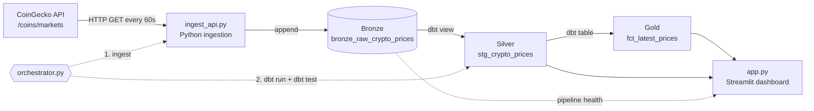
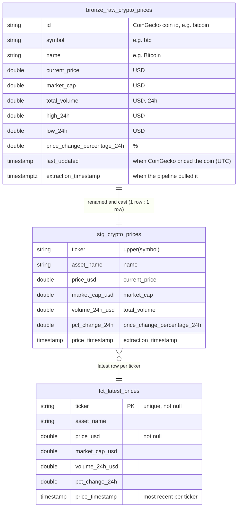

# Real-Time Crypto Analytics Pipeline

An end-to-end data pipeline that pulls live cryptocurrency prices from the CoinGecko API every 60 seconds and loads them into DuckDB. dbt transforms them through bronze, silver and gold layers, and a Streamlit dashboard shows the results.

**Stack:** Python · DuckDB · dbt (dbt-duckdb) · Streamlit · Plotly

## Architecture



| Step | Component | What it does |
|---|---|---|
| 1 | **CoinGecko API** | Public market data (no API key) for Bitcoin, Ethereum, Solana, Cardano and XRP. |
| 2 | **`ingest_api.py`** | Fetches the data, converts it to a DataFrame, adds an `extraction_timestamp`, and appends it to DuckDB. |
| 3 | **Bronze** (`bronze_raw_crypto_prices`) | Append-only table. Every poll is kept as its own snapshot. |
| 4 | **Silver** (`stg_crypto_prices`) | dbt view that renames, casts and standardises the bronze columns. |
| 5 | **Gold** (`fct_latest_prices`) | dbt table holding the latest price per ticker, chosen with `row_number()`. |
| 6 | **`orchestrator.py`** | Every 60 seconds: ingest, then `dbt run`, then `dbt test`. |
| 7 | **`app.py`** | Streamlit dashboard showing pipeline health, latest prices, 24h price history, market-cap share and 24h change. Refreshes every 15s. |

## Data model



| Table | Layer | Materialisation | Grain |
|---|---|---|---|
| `bronze_raw_crypto_prices` | Bronze | Table, loaded by Python | One row per coin per API poll |
| `stg_crypto_prices` | Silver | dbt view | Same as bronze |
| `fct_latest_prices` | Gold | dbt table, rebuilt every run | One row per ticker |

**dbt tests** on `fct_latest_prices`: `ticker` is `unique` and `not_null`, and `price_usd` is `not_null`.

## Project structure

```
.
├── ingest_api.py          # Extract from CoinGecko + load into bronze
├── orchestrator.py        # 60-second loop: ingest -> dbt run -> dbt test
├── app.py                 # Streamlit dashboard
├── requirements.txt
└── transformations/       # dbt project
    ├── dbt_project.yml
    └── models/
        ├── staging/
        │   ├── sources.yml
        │   └── stg_crypto_prices.sql
        └── marts/
            ├── schema.yml
            └── fct_latest_prices.sql
```

## Getting started

### 1. Install

Requires Python 3.11+ (developed on 3.14).

```bash
git clone <your-repo-url>
cd <repo>
python -m venv .venv
# Windows:  .venv\Scripts\activate
# macOS/Linux: source .venv/bin/activate
pip install -r requirements.txt
```

### 2. Configure the dbt profile

dbt reads connection settings from `~/.dbt/profiles.yml`. Add the following, and set `path` to the absolute path of `analytics.duckdb` in your clone. The Python scripts create this file in the repo root, so dbt has to point at the same file.

```yaml
transformations:
  target: dev
  outputs:
    dev:
      type: duckdb
      path: /absolute/path/to/repo/analytics.duckdb
      threads: 1
```

Check it with:

```bash
cd transformations && dbt debug
```

### 3. Run

Open two terminals from the repo root, with the virtualenv active in both:

```bash
# Terminal 1: start the pipeline (ingest + transform + test every 60s)
python orchestrator.py

# Terminal 2: start the dashboard
streamlit run app.py
```

The dashboard opens at http://localhost:8501. The first cycle creates the database. After that the "Status" metric shows **🟢 Live** as long as data arrived within the last 3 minutes.

To run the dbt models on their own:

```bash
cd transformations
dbt build     # run models + tests
```

## Known limitations and roadmap

This is a learning project. These are the next improvements planned:

- **Timestamps:** Use the API's `last_updated` as the event time and normalise all timestamps to UTC. Right now `price_timestamp` is the extraction time, cast into the machine's local time zone.
- **Deduplication:** CoinGecko caches responses, so consecutive polls can return the same price. Make silver incremental and deduplicate on `(id, last_updated)`.
- **Resilience:** Add retries with backoff for HTTP 429/5xx, make ingestion failures stop the dbt step instead of being skipped silently, and switch to structured logging.
- **dbt:** Replace `run` + `test` with `dbt build`. Add source freshness checks, tests on the source and silver layers, and a `fct_price_history` mart for the dashboard to read.
- **Packaging:** Ship `profiles.yml` inside the repo using `env_var()`, and add unit tests and CI.
- **Concurrency:** DuckDB allows one writer at a time, so the dashboard retries when the orchestrator holds the lock. For larger scale, move to MotherDuck/Postgres or use a real scheduler (Dagster, Prefect or Airflow).

## Data source

Market data from the [CoinGecko API](https://www.coingecko.com/en/api). The free tier is rate-limited, and polling once a minute stays well within it.
